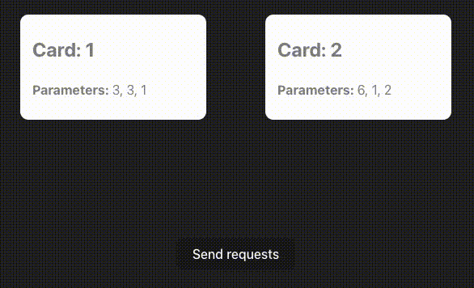
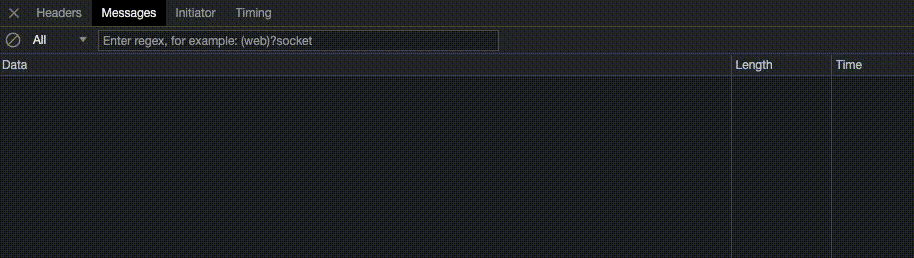

# MapSocket
Request-response mapped WebSocket implementation.

**Don't use this library in production code! It is only intended as a coding challenge and is therefore not complete, nor properly tested!**

## Table of contents
1. [User manual](#user-manual)
   1. [Using the library](#using-the-library)
   2. [Building the library](#building-the-library)
   3. [Starting the server](#starting-the-server) 
   4. [Starting the client](#starting-the-client) 
   5. [System in action](#system-in-action)
2. [Requirements](#requirements)
3. [Scope](#mapsocket-library)
   1. [MapSocket library](#mapsocket-library)
   2. [Server demo](#server-demo)
   3. [Client demo](#client-demo)
4. [Effort estimation](#effort-estimation)

## User manual
The following sections will show how to import and use the library in your own application. 
Additionally, it gives step-by-step instructions about running the example solution provided with the project.

### Using the library
If this library was production-ready, it would be published to npm and could be installed with this command: 
```shell
npm i mapsocket
```
Let's imagine for a second that this is the case, and the library has been successfully imported in a project.

The module exports two main classes, the `MapSocketServer` and the `MapSocketClient`. 
The `MapSocketServer` can be used the following way:

```ts
import { MapSocketServer } from "mapsocket";

const ms = new MapSocketServer(8080);
ms.on("<event name>", async (params) => {
    // return something
})
```

Similarly, the client can be used to dispatch calls to a `MapSocketServer` in the following way:

```ts
import { MapSocketClient } from "mapsocket";

const mc = new MapSocketClient(8080);
mc.invoke("<event name>", [1, 2, 3]).then(result => {
    // do something with the result
});

```

### Building the library
By following the steps below, you will be able to test the `mapsocket` library locally
by setting up and running the implemented example projects.

First, clone the repository locally by either downloading the project as a .ZIP archive, or by executing the following command:

```shell
git clone https://github.com/wlchs/mapsocket
```

At this point, it is assumed that you have Node.js installed on your machine, however, if
this is not the case, you'll have to install it (ideally version 18). You can find the required installer on the
[Node.js website](https://nodejs.org), or if you are using macOS, by executing the following command:

```shell
brew install node@18
```

Since the library is not published to npm, it has to be built before use.

```shell
# Navigate to the mapsocket library inside the repository
cd mapsocket

# Install dependencies
npm i

# Build the library
npm run build
```

### Starting the server
Now that you have the repository on you machine and Node.js is installed, you'll need to open two terminal instances to 
run the server and the client at the same time.

Navigate to the example server implementation in the first terminal window to start the demo `mapsocket` server.

```shell
# Navigate to the example server implementation
cd examples/mapsocket-server-example

# Install node dependencies
npm i

# Start the server listening on port 8080
npm start
```

Should the `npm i` step fail to execute, it is most likely that you will have to manually link the `mapsocket` library to the node modules.
To do you, run the following code:

```shell
# you might have to run this step as sudo, if you don't have the rights to create symlinks in the current directory
sudo npm link ../../mapsocket
```

### Starting the client
Now as the server is up and running, let's do the same with the client implementation.

In a new terminal window, navigate to the example client implementation.

```shell
# Navigate to the example server implementation
cd examples/mapsocket-client-example

# Install node dependencies
npm i

# Start the client demo
npm run build
npm run preview
```

Similarly to the server case, if linking the `mapsocket` library didn't work during `npm i`, repeat the step above.

### System in action
The client allows the user to dispatch multiple `mapsocket` requests on a simple UI.



The exact `WebSocket` messages which have been sent to the server can be seen in the browser network tab.



Logging has been implemented in the server library to provide verbose feedback about the requests that are being received.
Of course, in a production environment, a logging library would be used instead of `console.log`, but for demonstration purposes,
it is perfectly suitable in this case.

The system gives feedback about the received requests:


## Requirements
The project must fulfil the following requirements:
* implementation of a Node.JS library that provides request-response mapping on top of WebSockets
* implementation of a Vue (or React) -based UI project that showcases the implemented library in use

There are two additional constraints for the task:
* use the [ws](https://github.com/websockets/ws) library on the server-side
* no additional external dependencies are allowed, except those necessary for building / testing

## Scope
First of all, the requirements have to be broken down into smaller units of work.
After analysis, the following individual tasks have been identified:

* implementation of the MapSocket Node.JS library
    * server logic
    * client logic
* implementation of an example project that uses MapSocket on the server-side
* implementation of an example project that uses MapSocket on the client-side
* write documentation and user-manual

### MapSocket library
The two main features that the library offers are the `MapSocketServer` and the `MapSocketClient`. 

The server allows the user to open a socket listening for requests from the subscribed client(s) and respond to them.
Users can define custom handler methods that specify how different requests must be resolved. 

The syntax for defining request handler methods looks as follows:

```ts
ms.on('sum', async (params: number[]) => {
  return params.reduce((acc: number, n: number) => acc + n);
});
```

Where `sum` is the name of the procedure, and the `params` are the parameters sent by the client.

The client on the other hand is able to subscribe to an endpoint, send requests to it with predefined parameters, and receive the response.
To map requests to responses, a unique request ID is necessary. This is generated by the client and is sent with each request to the server.

The client syntax for dispatching requests:

```ts
mc.invoke('sum', [1, 2]).then(result => {
    console.log(result);
})
```

### Server demo
The example server implementation imports the `mapsocket` library as if it was an external dependency published in the `npm` registry. 

It creates a new `MapSocketServer` and defines some simple handler methods, like the one above.

### Client demo
The example client implementation, similarly to the server implementation, imports the `mapsocket` library and uses the `MapSocketClient` to
connect to the previously created socket. 

The UI is built with React, and showcases the advantages the `mapsocket` library gives over just simply using `WebSockets`. 
In this example, the client dispatches numerous requests simultaneously, to which a procedure is implemented by the server that introduces a
random delay before sending back a response. This random delay is supposed to simulate an "expensive" calculation / process that takes a 
while to complete in a real-world scenario. After receiving the responses, the UI displays the result by matching the dispatched request 
parameters with their respective responses.


## Effort estimation
Estimated workload in hours for each identified task in the scope.

| Task                              | Issue                                             | Estimate in hours |
|-----------------------------------|---------------------------------------------------|-------------------|
| `mapsocket` server implementation | [#1](https://github.com/wlchs/mapsocket/issues/1) | 4                 |
| `mapsocket` client implementation | [#2](https://github.com/wlchs/mapsocket/issues/2) | 2                 |
| server demo implementation        | [#3](https://github.com/wlchs/mapsocket/issues/3) | 1                 |
| client demo implementation        | [#4](https://github.com/wlchs/mapsocket/issues/4) | 3                 |
| documentation and user manual     | [#5](https://github.com/wlchs/mapsocket/issues/5) | 2                 |

More information about the individual tasks can be found under their respective GitHub issues.